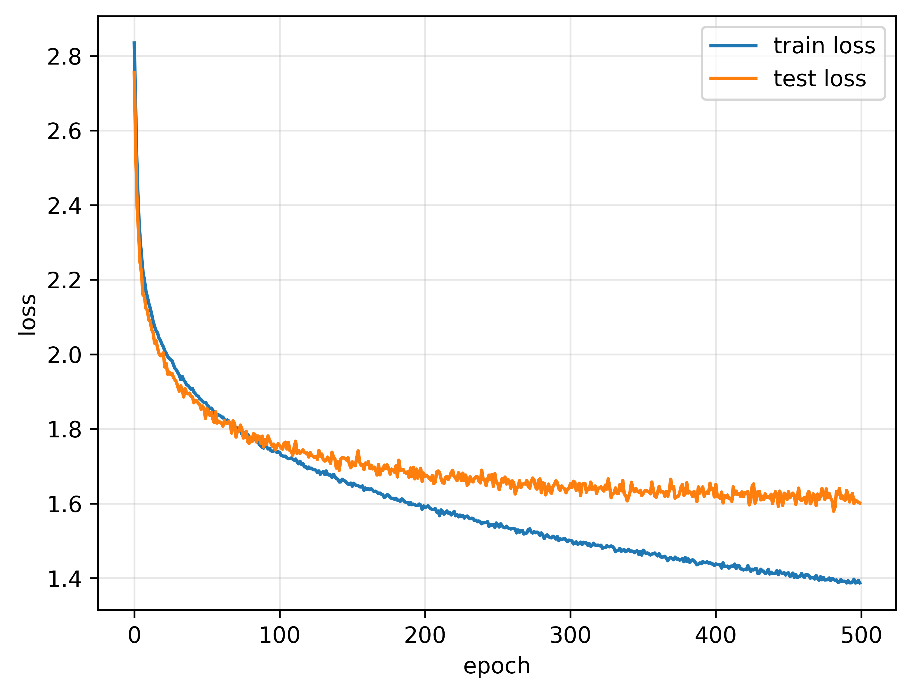

# Hangman Challenge with Transformer Model

This repository contains an implementation of a model to play the classic **Hangman challenge** using a Transformer-based approach. The environment for the game is provided in `utils.py`.

---

## Aim

The objective is to design a model that can successfully predict hidden letters in words, as in the Hangman game, by leveraging the **Transformer encoder architecture**.

---

## Data

The dataset used is **english-words.70**, which includes approximately 33,000 English words.  
- Source: [http://wordlist.aspell.net/](http://wordlist.aspell.net/)  
- Preprocessing: Only words with lengths between 4 and 20 letters are selected for this task.  
- Details of the data processing can be found in the `words_processing.ipynb` notebook.

---

## Methodology and Results

1. **Input Representation**:  
   - The input is a tokenized word, where a fraction of the letters are masked.  
   - The model predicts the probabilities for each letter at the masked positions.  

2. **Model Architecture**:  
   - A **Transformer encoder** is used to process the input.  
   - The model outputs probabilities for each letter, which are averaged across the masked positions to generate predictions.

3. **Masking Strategy**:
   - Surprisingly, using a **fixed mask rate** during training outperformed using a **varying mask rate**, even though varying the mask rate is closer to the actual task.  
   - A fixed mask rate of **50%** yielded the best results.

4. **Initial Guesses**:
   - Attempts to improve the first guess using letter frequency statistics did not improve the success rate.
   - Fully masked words (as in the start of the game) were not included in the training data, since this seems to be unnecessary.  

5. **Self-Attention Mechanism**:  
   - Adding a self-attention mechanism to predict the probabilities of letters across the entire word, rather than simply calculating the average probabilities across the masked positions, did not enhance performance.

The upper panel displays the training and test loss curves. The success rate reaches approximately 66% after 500 epochs of training. The lower panel illustrates the model's performance. 
The X-axis represents the word lengths, while the Y-axis shows the completion fraction per word. Dots represent the mean values, and error bars indicate one standard deviation. 
The gray lines depict the success rate for different word lengths. This panel highlights that the model performs poorly for shorter words.

---

## Discussion and Potential Improvements

1. **Reinforcement Learning**:  
   - The current model cannot utilize feedback from failed guesses during the game.  
   - Incorporating **Reinforcement Learning (RL)**, specifically **Proximal Policy Optimization (PPO)**, could help address this limitation.

2. **Short Word Analysis**:  
   - The model struggles with short words. Understanding the reasons behind this and modifying the training strategy or architecture could improve performance.

3. **Hyperparameter Tuning**:  
   - Testing larger embedding dimensions, additional encoder layers, and more attention heads could yield better results.

---

## Acknowledgments
Special thanks to @MorvanZhou for his insightful lessons on NLP. Check out his work at https://mofanpy.com/.
